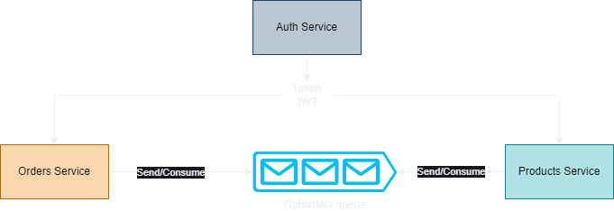

# Microsserviços com Node.js e RabbitMQ - Ecommerce tutorial

## Serviços
### Auth Service: registro e autenticação de usuários
#### Endpoints
    - /auth/register: registro de usuários
    - /auth/login: login de usuários
#### Porta: 3000
### Products Service: registro e busca de produtos
#### Endpoints
    - /product/create: registro de produtos
    - /product/buy: adiciona produto à compra
#### Porta: 3001
### Orders Service: registro de compras de produtos
#### Endpoints
    - Não possui endpoints, apenas uma função para registrar a compra, solicitando o produto do serviço Product Service
#### Porta: 3002
## Tecnologias utilizadas
- Node.js: servidor web
- MongoDB: banco de dados
- RabbitMQ: gerenciamento de filas e mensageria entre os microsserviços
- Docker para executar o MongoDB e o RabbitMQ

```docker run -d -p 27017:27017 --name mongodb mongo:latest```

```docker run -p 5672:5672 rabbitmq```

## Arquitetura do projeto
